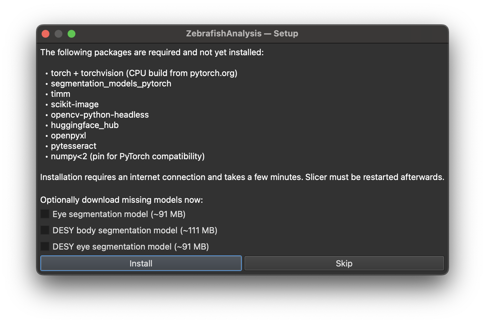
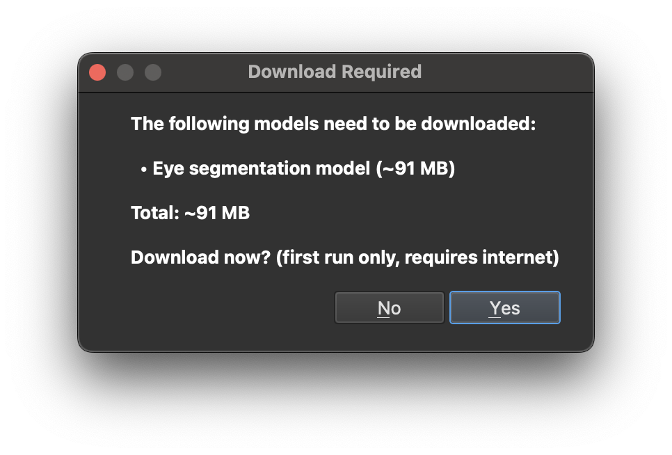
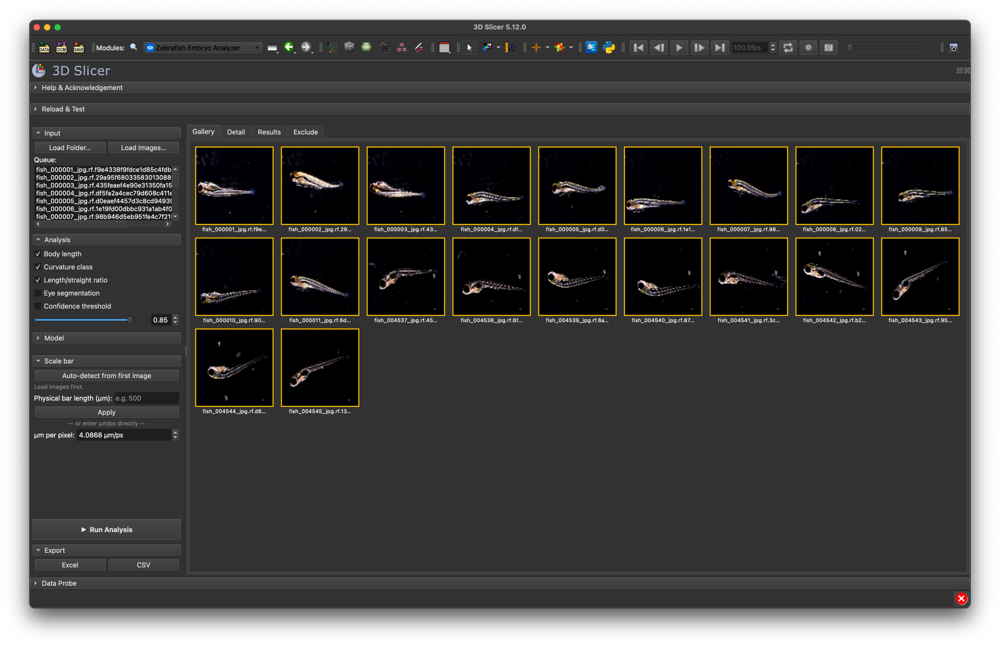
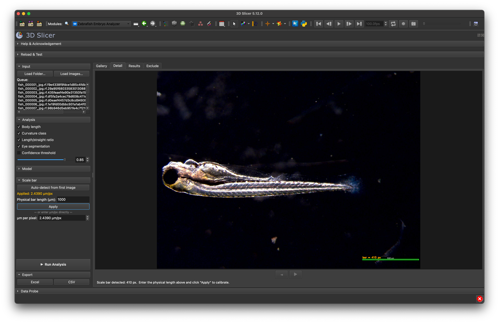
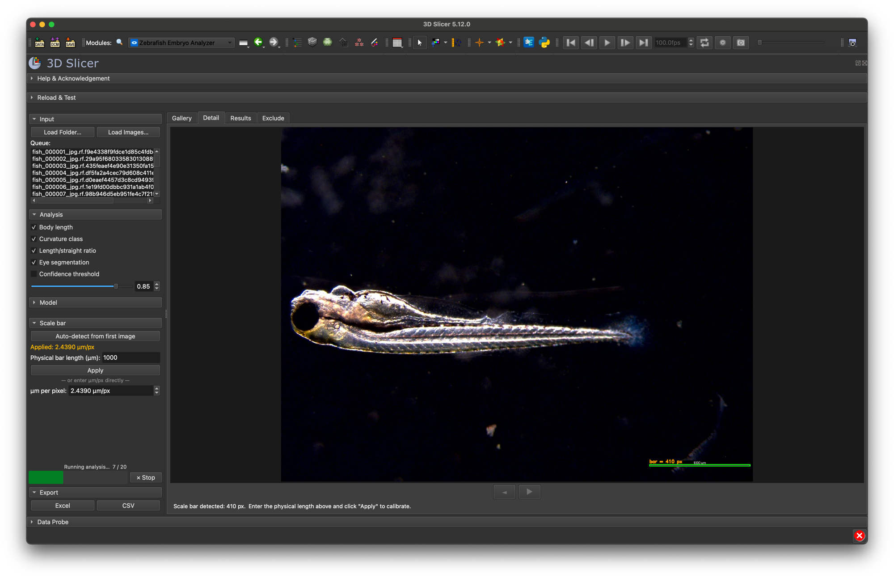
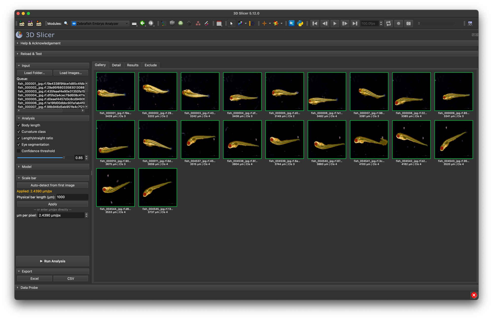
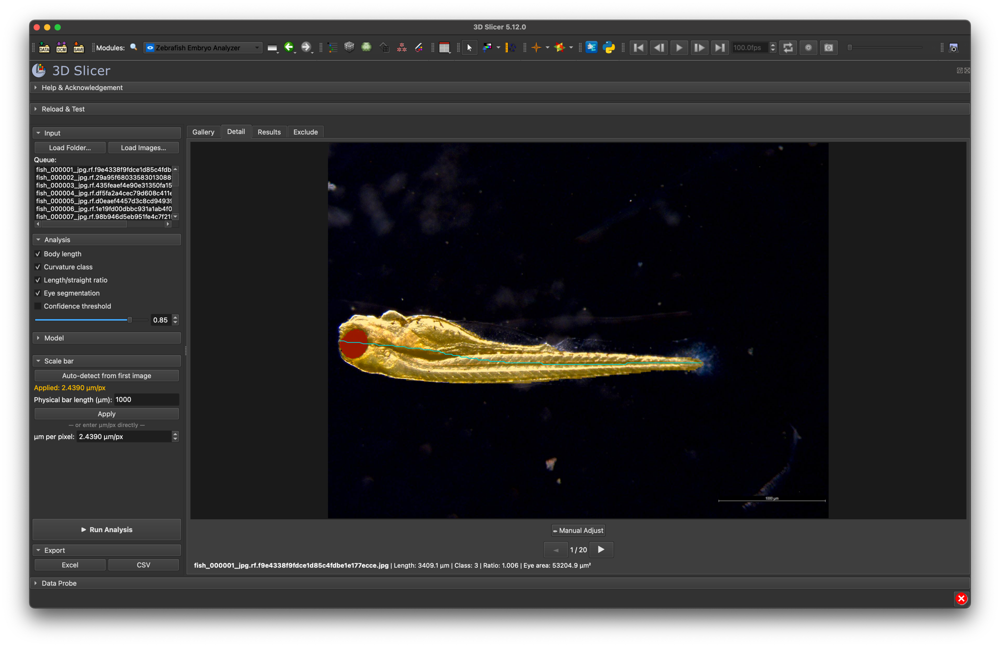
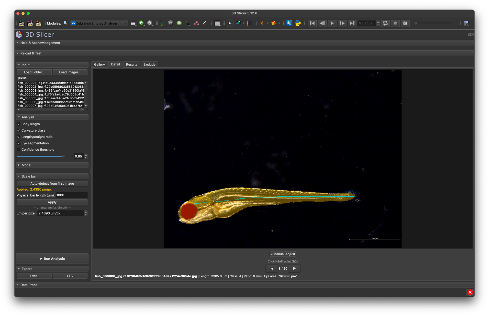
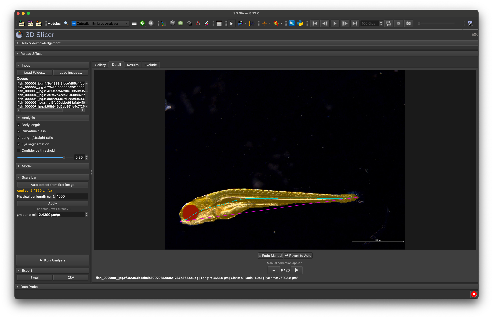
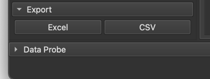

# 🐟 Zebrafish Embryo Analyzer

A 3D Slicer extension for batch offline zebrafish embryo morphometry from 2-D
microscopy images. Deep-learning models run entirely on your machine. No cloud, no data upload.


**Research use only. Not a medical device.**

---

## Table of Contents

- [What it does](#what-it-does)
- [How to use](#how-to-use)
  - [Installation](#installation)
  - [Python dependencies](#python-dependencies)
  - [Model download](#model-download)
  - [Loading images](#loading-images)
  - [Setting the scale](#setting-the-scale)
  - [Choosing measurements](#choosing-measurements)
  - [Running analysis](#running-analysis)
  - [Browsing results (Gallery tab)](#browsing-results-gallery-tab)
  - [Inspecting a single image (Detail tab)](#inspecting-a-single-image-detail-tab)
  - [Manual point correction](#manual-point-correction)
  - [Excluding images](#excluding-images)
  - [Exporting results](#exporting-results)
- [Measurements reference](#measurements-reference)
- [Curvature classes](#curvature-classes)
- [Slicer integration](#slicer-integration)
- [Development](#development)
- [Platform support](#platform-support)
- [Known limitations](#known-limitations)
- [Contributors](#contributors)
- [Acknowledgement](#acknowledgement)
- [License](#license)

---

## What it does

- Batch-loads 2-D microscopy images and measures each one without manual
  tracing
- Segments zebrafish body and eyes with deep-learning models (runs locally)
- Measures body length (µm), curvature class (1–4), length/straight-line ratio,
  eye area (µm²), and eye diameter (µm)
- Shows results in four tabs: **Gallery**, **Detail**, **Results**, **Exclude**
- Exports the measurements table to CSV and Excel
- Makes results accessible in Slicer's **Data** module and slice views for downstream Slicer workflows

---

## How to use

### Installation

The extension is not yet available through the Extensions Manager and must be installed manually from this repository.

1. Open **3D Slicer** (version 5.x).
2. Go to **Edit → Application Settings → Modules**.
3. Under **Additional module paths**, add the `ZebrafishEmbryoAnalyzer/` directory
   from this repository.
4. Click **OK** and restart Slicer.
5. On first open a dialog appears listing the Python packages that will be
   installed into Slicer's interpreter. Review the list and confirm. Nothing
   installs silently.
6. After installation finishes, restart Slicer a second time.
7. Open the **Zebrafish Embryo Analyzer** module from the **Modules** dropdown.

---

### Python dependencies

On first open you will be prompted to install:

| Package | Purpose |
|---------|---------|
| `torch`, `torchvision`, `timm`, `segmentation-models-pytorch` | ML inference |
| `opencv-python`, `scipy`, `scikit-image`, `pillow` | Image processing |
| `openpyxl`, `matplotlib` | Export |
| `numpy<2` | Pinned for torch compatibility |
| `platformdirs` | Cache path lookup (soft dependency, falls back gracefully) |

Total download is several GB (PyTorch alone ~2 GB). Takes several minutes.



You can also pre-download models here to skip the prompt on first run.

---

### Model download

If you pre-downloaded models during setup, skip this. Otherwise you will be prompted when clicking **Run Analysis** with a missing model. Models are cached after the first download.



---

### Loading images

Add one or more microscopy images for batch processing.

1. Click **Load Images** or **Load Folder** in the module panel.
2. Select images (multiple selection supported).
3. The loaded images appear in the list. Loading again replaces the previous selection.



---

### Setting the scale

All measurements are in micrometres. Set the pixel size before running analysis.

1. Enter the **µm/px** value in the scale field, or use the **scalebar
   detection** option to have the extension read the scale from an embedded
   scalebar in the image.
2. Verify the scale. All measurements depend on it.



---

### Choosing measurements

Toggle the measurements you need before running:

- **Length**: body length in µm along the midline
- **Curvature**: curvature class (1–4; see [Curvature classes](#curvature-classes))
- **Ratio**: body length divided by the straight-line head-to-tail distance
- **Eye segmentation**: eye area (µm²) and eye diameter (µm)

You can also set a **confidence threshold** and select the inference model via
the **Model** accordion:

- **General**: the default model, suitable for standard brightfield imaging
  conditions. Recommended as a starting point.
- **DESY variants**: fine-tuned for specific imaging setups at DESY.

---

### Running analysis

1. Click **Run Analysis**.
2. The first run loads models into memory and takes **10–30 s** to start.
3. When complete, the **Gallery**, **Results**, and other tabs populate automatically.



---

### Browsing results (Gallery tab)

The **Gallery** tab shows all analyzed images with overlays. Click a thumbnail to open it in the **Detail** tab.



---

### Inspecting a single image (Detail tab)

The **Detail** tab shows the selected image at full resolution with the segmentation overlay, body axis, and measurements. Open it by clicking a thumbnail in the **Gallery**.



---

### Manual point correction

If automatic head/tail detection is wrong, correct it manually.

1. In the **Detail** tab, click **→ Manual Adjust**.
2. Click the **head** position, then the **tail**. Applied automatically.





Click **Revert to Auto** to undo.

---

### Excluding images

Exclude images from exports without removing them from the session.

1. Open the **Exclude** tab.
2. Check the box next to each image you want to exclude.
3. Excluded images are omitted from CSV and Excel exports.

---

### Exporting results

Click **Export CSV** or **Export Excel**. Excluded images are omitted from both.



---

## Measurements reference

| Measurement | Unit | Description |
|-------------|------|-------------|
| Body length | µm | Length along the detected midline |
| Curvature class | - | 1 (most severe) to 4 (minimal) |
| Length/straight-line ratio | - | Midline length ÷ head-to-tail distance |
| Eye area | µm² | Area of each segmented eye region |
| Eye diameter | µm | Diameter of each segmented eye region |

---

## Curvature classes

| Class | Severity |
|-------|---------|
| 1 | Most severe curvature |
| 2 | Moderate-severe |
| 3 | Mild |
| 4 | Minimal curvature (most healthy) |

---

## Slicer integration

After each analysis the extension creates or updates the following data nodes,
visible in Slicer's **Data** module and slice views:

| Data | Type |
|------|------|
| Measurements table | Table |
| Currently selected image | Volume |
| Body and eye segmentation | Segmentation |

Nodes can be saved with the scene. After reopening, the Gallery, Detail, and Results tabs will be empty. Re-run the analysis to repopulate them.

---

## Development

The test suite under `tests/` can be run without Slicer:

```bash
python -m pytest tests/ -q
```

Slicer integration tests live in `ZebrafishEmbryoAnalyzer/Testing/Python/`.

CI runs on Ubuntu, macOS, and Windows (Python 3.11 and 3.12) via GitHub Actions.

---

## Platform support

| Platform | Status |
|----------|--------|
| macOS | Verified (development platform) |
| Windows | Not yet tested with Slicer |
| Linux | Not yet tested with Slicer |

---

## Known limitations

- First analysis run is slow (10–30 s) due to model loading into memory.
- After reopening a saved scene, the Gallery, Detail, and Results tabs will be empty. Re-run the analysis to restore them.

---

## Contributors

- Mark Daniel Arndt
- Jona Richter

Issues and questions: please open an issue in this repository and include your
Slicer version, OS, and a description of the problem.

---

## Acknowledgement

Based on the
[Zebrafish_webapp](https://github.com/MarkDanielArndt/Zebrafish_webapp) by Mark
Daniel Arndt.

---

## License

This project is licensed under the [Apache License 2.0](LICENSE).

> ⚠️ **Model weights** used by this extension are hosted on Hugging Face and have their
> own license terms. Check the model cards before use:
> - [markdanielarndt/Zebrafish_Segmentation](https://huggingface.co/markdanielarndt/Zebrafish_Segmentation)
> - [markdanielarndt/Classification](https://huggingface.co/markdanielarndt/Classification)
